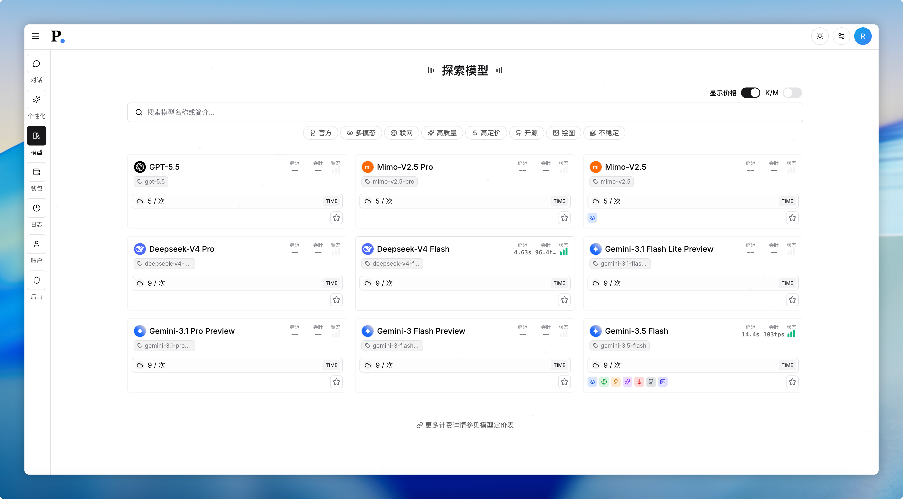
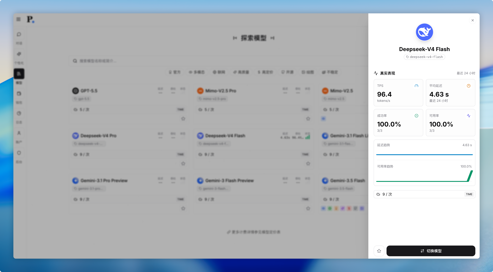

<div align="center">

# 🔮 Prism

[](https://github.com/qwq202/prism/stargazers)
[](https://github.com/qwq202/prism/network/members)
[](LICENSE)
[](https://go.dev/)
[](https://react.dev/)
[](https://hub.docker.com/r/qunqin45/prism)

**一站式 AI 网关与对话平台**

基于 OpenAI API 标准格式聚合多模型供应商，内置渠道管理、订阅计费、模型市场与管理后台。支持多渠道负载、窗口额度订阅、模型市场真实表现指标与 Docker 一键部署，适合搭建私有或商用 AI 服务站点。

<br>

[](#快速部署)
[](https://github.com/qwq202/prism/releases)

<br>

> 💡 **提示：** 首次空库启动会自动创建管理员 `root`。未设置 `ROOT_INITIAL_PASSWORD` 时，系统生成随机密码并写入启动日志。镜像地址为 `qunqin45/prism:latest`，日常开发与发布均使用 `main` 分支。

</div>

## 目录

- [界面预览](#界面预览)
- [核心能力](#核心能力)
- [支持模型](#支持模型)
- [快速部署](#快速部署)
- [本地开发](#本地开发)
- [配置说明](#配置说明)
- [常见问题](#常见问题)
- [技术栈](#技术栈)

## 界面预览

<details>
<summary>展开截图</summary>

**联网搜索** — OpenAI / Gemini / xAI 等模型走供应商原生搜索；其余模型通过 Tavily 检索增强。


**持久记忆** — 跨会话保存用户偏好，让模型持续了解每位用户。


**模型市场表现** — 展示 TPS、延迟、成功率与可用率趋势，辅助选型。





**双窗口配额** — 短周期（5 小时）与每周额度独立计算、独立重置。


**管理后台** — 用户、渠道、订阅、模型市场、公告等一站式运营。


**用量追踪** — 请求日志、Token 消耗与费用明细一目了然。


**通用联网搜索** — 非原生搜索模型使用 [Tavily](https://tavily.com/) API，并可用任务模型智能提取关键词。


**对象存储** — 兼容 S3、Cloudflare R2、MinIO 等协议。


</details>

## 核心能力

### 对话与体验

- 多模型对话，支持 Markdown / LaTeX / Mermaid、代码高亮与文生图工作台
- **联网搜索**：主流模型走供应商原生能力，其余模型通过 [Tavily](https://tavily.com/) 检索增强（见下）
- Reasoning / Thinking 展示（OpenAI、DeepSeek、xAI、MiMo 等）
- 工具调用（Tool Use）与内置网页抓取（Fetch Webpage）
- 持久化记忆、浏览器语音识别、长文本自动转附件
- 文件解析（PDF / Office / 图片等）、图片粘贴上传与发送前预览
- 对话跨端同步、分享（链接 / 图片）、PWA 安装
- 亮色 / 深色主题，多语言国际化（中 / 英 / 日 / 俄）

#### 联网搜索

Prism 按模型类型自动选择搜索路径，无需自建 SearXNG 等中间层：

| 类型 | 适用模型 | 说明 |
|------|----------|------|
| **原生搜索** | OpenAI Responses（如 GPT-5 系列）、Gemini、xAI Grok | 直接调用供应商 Web Search / Google Search / X Search 等原生工具 |
| **Tavily 增强** | 其他已开启联网的模型 | 通过 [Tavily API](https://tavily.com/) 获取实时结果，并可配合任务模型提取搜索关键词后注入上下文 |

后台 **系统设置 → 联网搜索** 中配置 Tavily API Key、搜索深度、主题与结果数量；任务模型用于关键词提取（`system.task.model`）。

### 模型与渠道

- OpenAI API 标准格式分发与中转
- 多渠道管理：优先级、权重负载、用户分组、失败重试、模型映射与重定向
- 模型市场与预设系统，展示真实调用表现指标
- 模型缓存：相同请求入参命中缓存时不计费
- 快速同步上游配置（渠道、模型市场、价格等）

### 计费与运营

- **弹性计费**：按次 / 按 Token / 不计费，支持最小请求点数检测
- **订阅制**：窗口额度模式（短周期 + 每周双窗口），套餐级额度池
- 礼品码与兑换码体系，支持批量生成
- 完整请求日志与用量明细

### 管理后台

- 仪表盘、公告通知、用户管理（含批量操作与直接创建）
- 订阅套餐、价格设定、渠道配置、模型市场
- 站点名称 / Logo、SMTP、附件管理等

## 支持模型

| 供应商 | 能力概览 |
|--------|----------|
| OpenAI & Azure | Vision、Function Calling、GPT-5 系列、Reasoning Summaries、原生 Web Search |
| Anthropic Claude | Vision、Function Calling |
| Google Gemini | Vision、原生 Google Search / URL Context |
| DeepSeek | V4、Thinking 控制、Prompt Cache 统计 |
| xAI Grok | Responses API、原生 Web Search / X Search、Writable Memory、Reasoning |
| Xiaomi MiMo | Thinking Toggle、Token Plan China |
| MiniMax | Token Plan CN |
| GLM | Coding Plan CN |
| LocalAI / Ollama | OpenAI 兼容格式 |

## 快速部署

> [!TIP]
> 首次空库启动会自动创建管理员 `root`。未设置 `ROOT_INITIAL_PASSWORD` 或 `root.initial_password` 时，系统生成随机密码并写入启动日志。

### Docker Compose（推荐）

访问地址：`http://localhost:8000`

```shell
git clone --depth=1 --branch=main --single-branch https://github.com/qwq202/prism.git
cd prism
docker compose up -d
```

自定义数据库密码、镜像标签、`SECRET` 或 `root` 初始密码时，复制 `.env.example` 为 `.env` 后修改（`.env` 已被 git 忽略，请勿提交真实密钥）。

**版本更新**（已启用 Watchtower 时可跳过手动更新）：

```shell
docker compose down
docker compose pull
docker compose up -d
```

**数据与配置目录**

| 路径 | 说明 |
|------|------|
| `./db` | MySQL 数据 |
| `./redis` | Redis 数据 |
| `./config` | 配置文件（首次启动自动生成 `config.yaml` 与随机 `secret`） |

**部署后自检**

```shell
docker compose ps
curl http://localhost:8000/health
```

`/health` 返回服务、MySQL、Redis 状态；`status` 非 `ok` 时请查看 `docker compose logs`。开启 `SERVE_STATIC=true` 时也可通过 `/api/health` 访问。

> [!NOTE]
> MySQL 容器首次初始化后账号密码写入 `./db`；已有数据目录时再改 `.env` 中的 MySQL 密码不会自动迁移，需手动改库内密码或重新初始化。

### 单容器 Docker（外置 MySQL / Redis）

访问地址：`http://localhost:8094`

```shell
docker run -d --name prism \
  --network host \
  -v ~/config:/config \
  -v ~/logs:/logs \
  -v ~/storage:/storage \
  -e MYSQL_HOST=localhost \
  -e MYSQL_PORT=3306 \
  -e MYSQL_DB=prism \
  -e MYSQL_USER=root \
  -e MYSQL_PASSWORD=your_mysql_password \
  -e REDIS_HOST=localhost \
  -e REDIS_PORT=6379 \
  -e SECRET=replace_with_a_random_32_byte_string \
  -e ROOT_INITIAL_PASSWORD=replace_with_a_strong_initial_password \
  -e SERVE_STATIC=true \
  qunqin45/prism:latest
```

| 环境变量 | 说明 |
|----------|------|
| `SECRET` | JWT 密钥，至少 32 位随机字符串 |
| `ROOT_INITIAL_PASSWORD` | 空库首次启动的 `root` 密码（6–36 位）；也可从日志读取随机密码 |
| `SERVE_STATIC` | 是否由后端提供静态文件（默认 `true`） |

```shell
curl http://localhost:8094/health   # 健康检查
docker stop prism && docker rm prism && docker pull qunqin45/prism:latest  # 更新镜像
```

### 前后端分离

- 前端：Nginx / Vercel 等静态托管，构建时设置 `VITE_BACKEND_ENDPOINT`（如 `https://api.example.com`）
- 后端：设置 `SERVE_STATIC=false`，API 独立域名部署
- Prism 本体不支持 Vercel 全栈部署，仅可将前端部署至 Vercel

### ARM 架构

公开镜像 `qunqin45/prism:latest` 为 `linux/amd64`。ARM 机器可本地源码构建，或使用 BuildX 构建 `linux/arm64` 镜像。

## 本地开发

**依赖**：Go、Node.js（pnpm）、MySQL 8、Redis 7

```shell
# 后端
go build .
go test ./...

# 前端
cd app && pnpm install && pnpm dev    # 开发服务器
cd app && pnpm lint                   # ESLint
cd app && pnpm build                  # 生产构建 → app/dist

# 完整服务栈
docker compose up -d
```

后端入口为 `main.go`；前端源码在 `app/src/`。配置参考 `config.example.yaml`。

## 配置说明

| 项 | 说明 |
|----|------|
| `secret` | JWT 签名密钥，首次启动可自动生成 |
| `root.initial_password` | 管理员初始密码，等同环境变量 `ROOT_INITIAL_PASSWORD` |
| `serve_static` | 前后端同进程部署时保持 `true` |
| `system.general.backend` | 后端 API 地址；默认同域 `/api`，分离部署时填完整 URL |
| `ALLOW_ORIGINS` | 严格跨域白名单，逗号分隔域名（无需协议前缀） |
| `system.search.api_key` | Tavily API Key，供非原生搜索模型使用 |
| `system.search.depth` | Tavily 搜索深度：`basic` / `advanced` / `fast` / `ultra-fast` |
| `system.task.model` | 联网搜索关键词提取所用模型（可选） |

完整配置项见 [`config.example.yaml`](config.example.yaml)。

## 常见问题

### 聊天一直转圈

聊天通过 WebSocket 通信（API 中转走 HTTP，无需 WebSocket）。请确认反向代理（Nginx / Apache）、CDN 或端口转发已启用 WebSocket 支持。

### 外部依赖

| 服务 | 用途 |
|------|------|
| MySQL | 用户、对话、配置等持久化数据 |
| Redis | 鉴权、限流、订阅配额、验证码等 |

### 找回或修改 root 密码

1. 首次启动未预设密码时，从 `docker compose logs` 查看随机密码
2. 登录后：后台 → 系统设置 → 修改 Root 密码；或在用户管理中修改
3. 无法登录时：
   - Compose：`docker compose exec chatnio prism root <new-password>`
   - 单容器：`docker exec prism prism root <new-password>`
   - 二进制：`./prism root <new-password>`

### 计费方式

- **弹性计费（点数）**：通用按量计费，默认 10 点数 = 1 元，可在计费规则模板中调整
- **订阅**：固定价格 + 窗口额度；扣费使用点数（如 32 元计划需 ≥ 320 点数）
- 订阅分四个等级：普通用户 (0)、基础版 (1)、标准版 (2)、专业版 (3)，对应渠道用户分组

### 礼品码 vs 兑换码

| 类型 | 特点 | 适用场景 |
|------|------|----------|
| 礼品码 | 同类型每用户仅能兑换一次 | 福利发放、宣传 |
| 兑换码 | 同类型可被多用户兑换 | 发卡销售、批量购买 |

### 最小请求点数（`user quota is not enough`）

- 不计费模型：无限制
- 按次计费：最小点数 = 单次请求点数
- 按 Token 计费：最小点数 = 1K 输入价 + 1K 输出价

### 模型映射

渠道内格式为 `[from]>[to]`，每行一条。`from` 为用户请求的模型，`to` 为实际上游模型。

```
gpt-4-all>gpt-4          # 映射 gpt-4-all 到 gpt-4
!gpt-4-all>gpt-4         # 加 ! 前缀：该渠道不暴露 gpt-4，仅暴露 gpt-4-all
```

### 支付方式

在系统设置中配置购买链接（发卡地址）；兑换码在后台批量生成。

## 技术栈

| 层 | 技术 |
|----|------|
| 前端 | React、Redux、Radix UI、Tailwind CSS |
| 后端 | Go、Gin、MySQL、Redis |
| 其他 | PWA、WebSocket |

## 支持

如果这个项目对你有帮助，欢迎点个 Star。

功能更新与版本说明见 [GitHub Releases](https://github.com/qwq202/prism/releases)。
